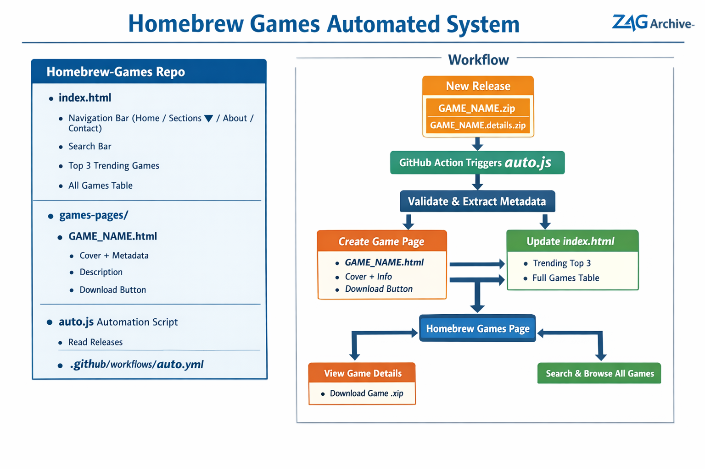
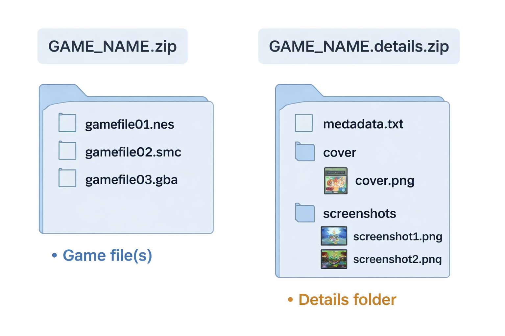

# ZAG Archive – Homebrew Games System

  
*Figure 1: Homebrew Games automation workflow*

  
*Figure 2: How to submit a game (zip files and folders)*

---

## Overview

The **ZAG Archive Homebrew Games system** automatically generates game pages from releases.

**Key Features:**
- Automatic HTML page generation
- Trending grid (3 most downloaded games of the month)
- Full table of all games (newest releases first)
- Search bar by game title or console
- Fully mobile and desktop friendly
- Repo stays under 1GB by storing **only metadata and HTML**, not game files

---

## Repository Structure