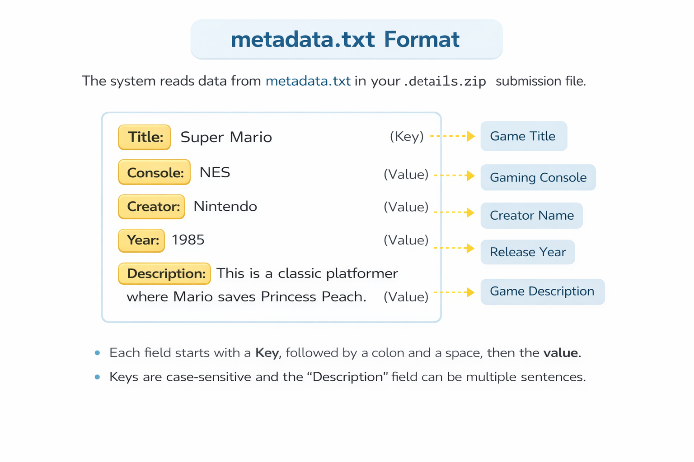

# ZAG Archive – Homebrew Games System

  

  
*Figure 1: Homebrew Games automation workflow*  
**Explanation:** Upload `GAME_NAME.zip` + `GAME_NAME.details.zip` → GitHub Action triggers `auto.js` → HTML pages generated automatically.

  
*Figure 2: How to submit a game (zip files and folders)*  
**Explanation:** Each game requires two zip files:  
1. `GAME_NAME.zip` → the actual game file  
2. `GAME_NAME.details.zip` → contains metadata.txt, cover images, screenshots  
Both must have matching prefixes to link correctly.

  
*Figure 3: Required format for metadata.txt inside GAME_NAME.details.zip*  
**Explanation:** The automation system reads this metadata to generate the game pages automatically. Example:

Title: Super Mario

Console: NES

Creator: Nintendo

Year: 1985

Description: This is a classic platformer where Mario saves Princess Peach.

- Each key is **case-sensitive**  
- `Description` can have multiple sentences  
- The system uses these fields to fill the game HTML page and index

---

## Overview

The **ZAG Archive Homebrew Games system** is a fully automated platform for hosting and managing community-made games.

**Key Features:**
- Automatic generation of HTML pages from GitHub releases  
- Homebrew Games index page with:
  - Trending grid (3 most downloaded games of the month)  
  - Complete table of all games (newest releases first)  
  - Search functionality by title or console  
- Fully mobile and desktop friendly  
- Repository stays under 1GB by storing **only metadata and HTML**, not game files  

---

## Repository Structure

- **assets/** → Diagrams, logos, and CSS for documentation and styling  
- **games-pages/** → Auto-generated HTML pages for each game  
- `index.html` → Main Homebrew Games page  
- `auto.js` → Automation script that reads releases and generates HTML pages  
- `.github/workflows/auto.yml` → GitHub Action workflow that triggers the automation  

---

## Game Submission System

Each game must have **two zip files**:

| File | Purpose |
|------|---------|
| `GAME_NAME.zip` | The actual game file (downloadable) |
| `GAME_NAME.details.zip` | Metadata + cover + screenshots (`metadata.txt`, `cover/`, `screenshots/`) |

> Both files must exist before the automation runs.

**Steps to Submit a Game:**
1. Prepare the two zip files with matching names.  
2. Upload them as a **new release** on GitHub.  
3. GitHub Action triggers `auto.js`.  
4. Wait for the workflow to complete:
   - HTML pages generated in `games-pages/`  
   - `index.html` updated automatically  

---

## Benefits

- Fully automated  
- Repository stays under 1GB  
- Mobile & PC friendly  
- Supports large libraries with pagination  
- Easy maintenance: upload release zips only  

---

## Useful Links

- Homebrew Games index: [https://zagv2.github.io/Homebrew-Games/](https://zagv2.github.io/Homebrew-Games/)  
- ROM Hacks & Patches: [https://zagv2.github.io/romhacks-patches/](https://zagv2.github.io/romhacks-patches/)  
- ZAG Archive home: [https://zagv2.github.io/ZAGArchive-/index.html](https://zagv2.github.io/ZAGArchive-/index.html)  
- About: [https://zagv2.github.io/ZAGArchive-/about.html](https://zagv2.github.io/ZAGArchive-/about.html)  
- Contact: [https://zagv2.github.io/ZAGArchive-/contact.html](https://zagv2.github.io/ZAGArchive-/contact.html)
